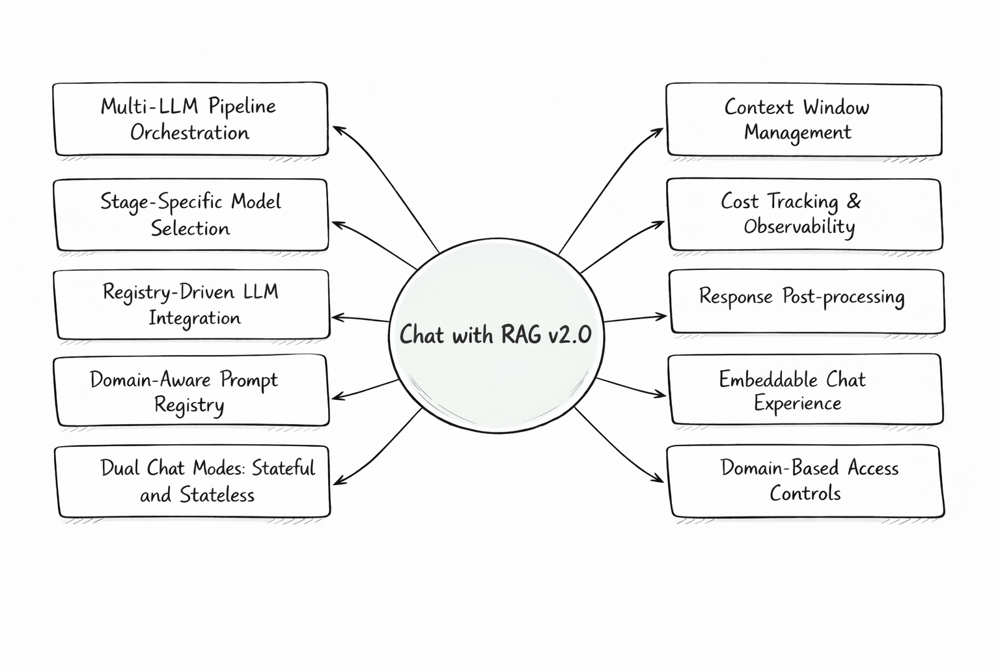
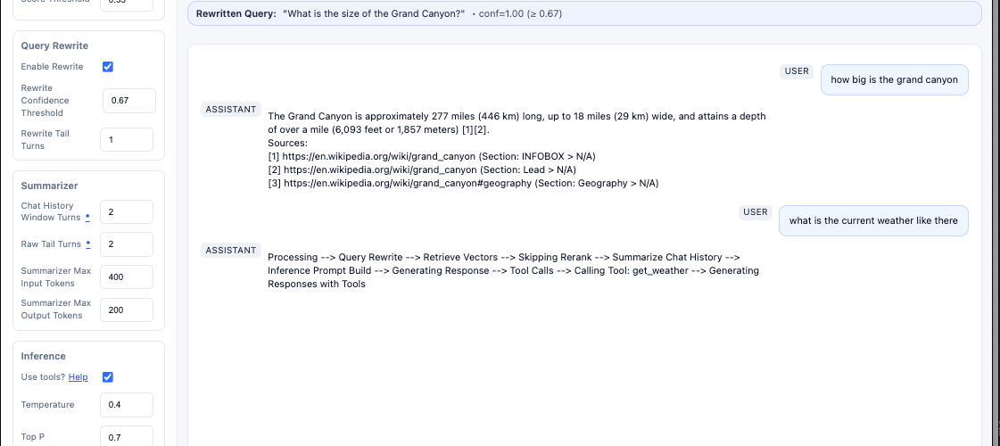
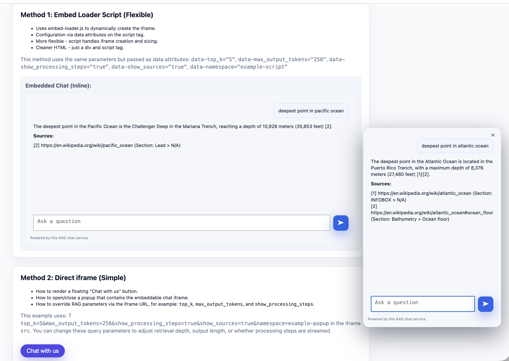
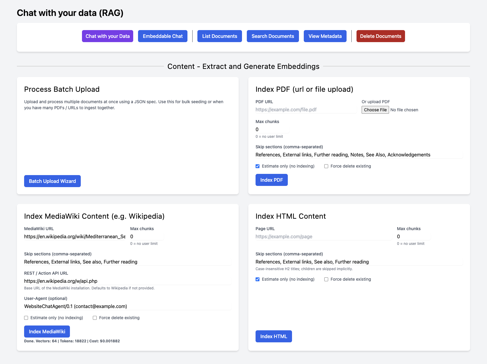
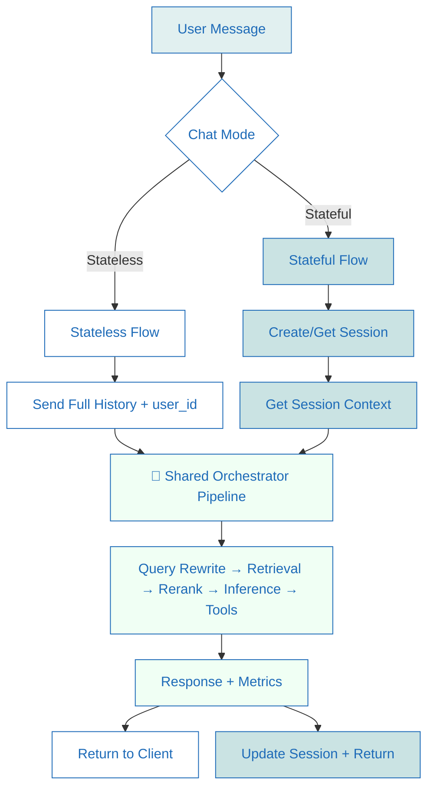
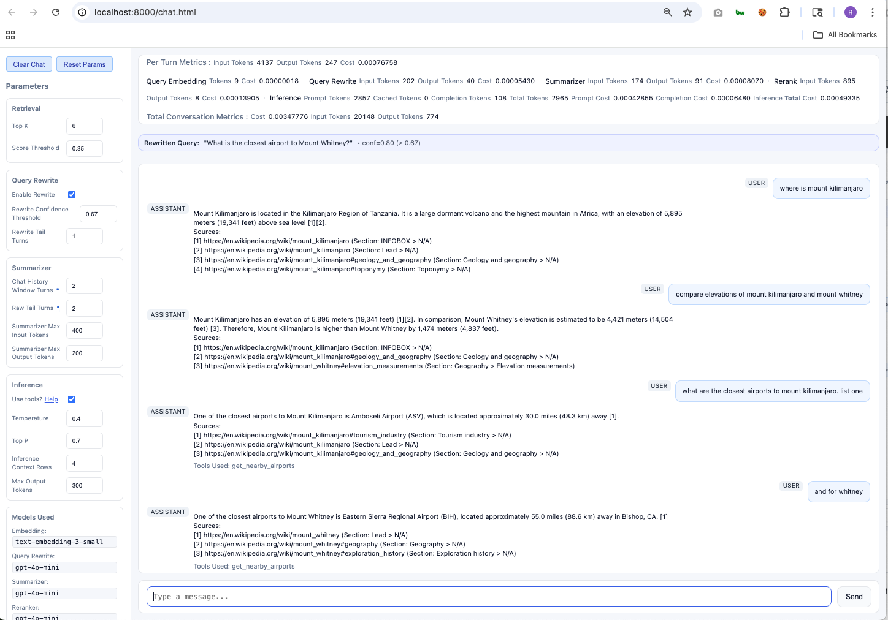

# Chat with Your Docs: End-to-End RAG Pipeline


A modular **Tool-Assisted Retrieval-Augmented Generation (RAG) framework** for building AI applications that generate grounded answers with **citations** from structured and unstructured knowledge sources.

Unlike simple vector-search demos, this project provides a **multi-stage RAG pipeline** with configurable retrieval, prompts, models, tools, and observability.


**🚀 Get Started:** See section **[Getting Started](#-getting-started)** to run the system locally.

### 🆕 What's New in v2.0

- **Multi‑LLM Pipeline Orchestration**  
Use different LLM providers and models across pipeline stages through the **vrraj‑llm‑adapter**, based on cost, capabilities, and task suitability.

- **Stage-Specific Model Selection**  
Runtime model selection per pipeline stage (rewrite, rerank, summarization, inference) via UI or API.

- **Registry-Driven LLM Integration**  
Model capabilities, pricing, and parameter policies are referenced from the adapter’s (**[vrraj-llm-adapter](https://pypi.org/project/vrraj-llm-adapter/)**) registry. This can be extended/overridden with a **custom registry**.

- **Domain-Aware Prompt Registry**  
Centralized prompt control layer that decouples prompts from application code. Prompts are grouped by domain/pipeline stage in a **YAML-driven registry** enabling rapid prompt experimentation and domain‑specific pipeline behavior.

- **Advanced Context Window Management**  
Hybrid strategy combining summarized conversation history with recent verbatim turns to maintain context while controlling token usage. [See Technical Overview](https://github.com/vrraj/chat-with-rag/blob/main/docs/technical-overview.md#5-context-assembly) for implementation details.

- **Cost Tracking and Observability**  
Real-time stage visibility, token accounting, and per-stage cost tracking across the pipeline.

- **Response Post-processing**  
Configurable output transformation layer, currently supporting Markdown → scoped HTML conversion and extensible post-processing workflows.

- **Embeddable Chat Experience**  
Drop-in widget with comprehensive configuration via API params.

- **Domain-Based Access Controls**  
Isolation and authorization enforced consistently across APIs and embedded clients.

- **Dual Chat Modes: Stateful and Stateless**  
Support for both **stateless** (`/chat`) and **stateful** (`/chat/{session_id}`) chat patterns.

**For additional details, see the [Release Notes 2.0](Release_Notes_2.0.md).**

<p align="center">
  
</p>

> **Auth & Security Note**  
This app enforces **domain-based access controls** across APIs and embedded widgets (domain isolation, collection separation, widget lockdown). See **[Security & Deployment](#-security--deployment)** for more details.


---

## High-Level RAG Pipeline Overview

The system runs through two parallel workflows: an **Ingestion Pipeline** (build the knowledge base) and a **Chat Orchestration Pipeline** (retrieve + answer).


| Pipeline | Flow |
|---|---|
| **Ingestion** | `Documents / URLs` → `Load Sources` → `Extract & Parse` → `Chunk & Normalize` → `Metadata Augmentation` → `Embeddings` → `Vector Storage` |
| **Chat** | `User Prompt` → `Query Rewrite` → `Retrieval` → `(Optional) ColBERT Late Interaction` → `(Optional) Local Cross-Encoder Rerank` → `Context Assembly` → `LLM Inference` → `Tool Execution` → `Response Synthesis` → `Post-Processing` → `Final Response` |

```mermaid
%%{init: {'themeVariables': { 'fontSize': '16px', 'subgraphFontSize': '20px', 'subgraphTitleColor': '#1e6bb8'}}}%%
graph LR
    %% Theme Styling from your finalized Hub
    classDef core fill:#dcebe8,stroke:#1e6bb8,stroke-width:1px,color:#1e6bb8,font-weight:bold;
    classDef feat fill:#ffffff,stroke:#1e6bb8,stroke-width:1px,color:#1e6bb8;
    classDef highlight fill:#159957,stroke:#159957,stroke-width:2px,color:#fff,font-weight:bold;

    subgraph "CHAT ORCHESTRATION"
        direction LR
        U[User Prompt] --> QR[Query Rewrite]
        QR --> Search[Retrieval]
        Search --> ColBERT[ColBERT Late Interaction (optional)]
        Search --> R
        ColBERT --> R[Local Cross-Encoder Rerank (optional)]

        %% Return path from Ingestion back to Chat
        R --> Ctx[Context Assembly] --> Inf[LLM Inference]

        Inf --> Tools{Tool Execution?}
        Tools -- "Yes" --> API[Tool Calls] --> Synth[Response Synthesis] --> Post[Post-Processing]
        Tools -- "No" --> Synth
        Synth --> Post
        Post --> Out[Final Response]
    end

    subgraph "INGESTION PIPELINE"
        direction LR
        S[Sources] --> P[Parse] --> C[Chunk] --> D[Add Metadata] --> E[Embed] --> DB[(Vector DB)]
    end

    %% PHYSICAL CONNECTIONS
    Search -- "Query" --> DB
    DB -- "Results" --> ColBERT
    DB -- "Results" --> R

    %% Apply Themes
    %% Using 'core' style for the main entry/exit and database
    class U,Out,DB core;
    %% Using 'feat' style for standard logic steps
    class QR,Search,ColBERT,R,Ctx,API,Post,S,P,C,D,E feat;
    %% Using 'highlight' (Cayman Green) for the critical LLM stages
    class Inf,Synth highlight;
```

---

## Example Use Cases

This project serves as a **reference architecture for production-style Tool-Assisted RAG systems**. Typical use cases include:

- **Document-grounded assistants** for PDFs, HTML pages, internal documentation, and MediaWiki-based knowledge sources
- **Multi-LLM experimentation** across pipeline stages for retrieval, reranking, summarization, and inference
- **Prompt and retrieval tuning** using query rewrite, reranking, and domain-specific prompt configurations
- **Embeddable knowledge assistants** for websites and internal portals
- **API-driven Tool-Assisted RAG workflows** for chat, ingestion, embedded experiences, and runtime pipeline control
- **Domain-specific knowledge bases** with separate collections, embeddings, and prompt domains
- **Observable Tool-Assisted RAG systems** where each pipeline stage can be inspected, tuned, and cost-tracked

### 📸 Inference Pipeline in Action

The screenshot below shows a **live chat** run through the inference pipeline, highlighting key system capabilities:

- Query rewrite for improved retrieval
- Multi‑turn context preservation
- Retrieval + inference working together
- Optional tool calls
- Multi‑model execution (OpenAI and Gemini)
- HTML‑formatted responses with citations

<p align="center">
  <a href="images/chat-pipeline-rewrite-context-tools-inference.png">
    
  </a>
</p>

*Chat pipeline UI showing query rewriting, multi-turn context handling, explicit pipeline stages, tool invocation, and cited responses.*

### 📦 Embedded RAG Chat Experience

The screenshot below illustrates the two configuration options for the chat widget:

- **Direct iframe embedding** (simplest)
- **Embed loader script** using HTML `data-*` attributes (advanced configuration)

<p align="center">
  <a href="images/chat-embedding-options.png">
    
  </a>
</p>

See the **[Embeddable Widget Configuration](#-embeddable-widget-configuration)** section below for implementation examples.

### 🖥️ Application Workspace
The workspace provides a central entry point to the main parts of the application. From here you can open the chat interface, manage documents, inspect the vector store, run batch ingestion, and configure embeddable chat experiences.

<p align="center">
  <a href="images/content-ingestion-primary-actions.png">
    
  </a>
</p>

*Content ingestion UI showing primary actions and indexing tools (batch upload, PDF/HTML/MediaWiki), estimation mode, and metadata controls.*

---

## Features

### 1. Dual Chat Modes
- **Stateless** (`/chat`) — Client-managed history for web frontends
- **Stateful** (`/chat/{session_id}`) — Server-managed sessions for backend and mobile integrations
- **Shared orchestration** — Both modes use the same RAG pipeline

> **See details:** [Session-Based Chat API](#-session-based-stateful-chat-api)

### 2. High-Fidelity Ingestion
- **Multi-source extraction** — Parse **PDFs**, **MediaWiki**, and **HTML**
- **Structured processing** — Smart chunking, structure preservation, and configurable noise filtering
- **Batch ingestion** — Process local directories (`file://`) or remote URLs with optional token and cost estimation

### 3. Advanced Orchestration

Coordinates retrieval, context management, prompt selection, model execution, tool use, observability, and output rendering in a deterministic multi-stage pipeline.

#### 3.1 Pipeline Orchestration
- **Stage-aware execution** — Query Rewrite → Retrieval → Rerank → Summarization → Inference → Tools → Post-processing
- **Stage-specific models** — Configure models per stage based on cost, capabilities, and task suitability
- **API-driven control** — Runtime pipeline configuration via FastAPI endpoints
- **Provider abstraction** — Uses **vrraj-llm-adapter** and the YAML prompt registry to decouple models and prompts from application code

#### 3.2 Context Management
Long-running conversations remain coherent through a hybrid strategy combining a persistent summary with a bounded recent-history window, keeping context stable and cache-efficient.

#### 3.3 Query Rewrite
Improves retrieval accuracy by selectively refining user intent before search. Rewrites are confidence-gated, context-aware, and configurable per request.

#### 3.4 Retrieval, Inference & Tools
- **Vector retrieval** — Configurable Qdrant search with top-k and score thresholds
- **Context assembly** — Builds prompts from instructions, retrieved context, documents, and tool results
- **Tool execution** — Native function calling (web search, weather, airports)
- **Verified citations** — Final responses include citations to source URLs and document sections where available

#### 3.5 Observability & Cost Tracking
- **Real-time observability** — SSE stream exposing pipeline stage execution and intermediate events
- **Per-stage accounting** — Token usage and cost metrics for every turn

#### 3.6 Post-Processing
- **HTML rendering** — Markdown → scoped HTML conversion for rich display
- **Isolated stage** — Output formatting evolves independently from core inference
- **Extensible pipeline** — Supports custom post-processing workflows

### 4. Embeddable Chat Experience
- **Website-ready widget** — Embed the full RAG experience into external sites
- **Configurable behavior** — Control pipeline parameters through runtime configuration
- **Domain-aware isolation** — Support separate knowledge bases and prompt domains per deployment


---

## 🚀 Getting Started

Get the system running in minutes using the provided `Makefile`. This setup uses Docker for the core infrastructure while maintaining a developer-friendly local environment through volume mounting.

> **Provider Note:** The system supports both **OpenAI** and **Gemini**, and providers can be switched or mixed **per pipeline stage** after setup.


### 📋 1. Prerequisites
Ensure your environment meets these requirements before proceeding:
- **OS:** macOS or Linux (Windows supported via Docker).
- **Git** – required to clone the repository. Install: https://git-scm.com/downloads
- **Docker & Docker Compose:** Required for the Qdrant v1.14.1 database and the web app container. [Get Docker here](https://docs.docker.com/get-started/)
- **Python 3.10+:** Required for local development, IDE support, and ingestion scripts.
- **LLM Provider API Key(s):** Supports **OpenAI** and **Gemini**. For the model configuration details, see the **[Model Registry documentation](https://vrraj.github.io/llm-adapter/model-registry.html)**.

> [!TIP]
> > [!TIP]
> The system requires an **OpenAI** or **Gemini** API key for LLM inference.  
> Add your key(s) to the `.env` file during setup.  
> See **[Configure API Keys and Budget Controls](#configure-api-keys-and-budget-controls)** for guidance.

### ⚡2 Automated Setup- Preferred

To bootstrap the environment quickly, run the setup script below.

**Step 1 — Run the bootstrap script**

```bash
git clone https://github.com/vrraj/chat-with-rag.git
cd chat-with-rag
bash scripts/rag_setup.sh
```

The script will automatically:

- create `.env` from `.env.example` (if it does not already exist)
- start Docker services (`make start`)
- create a Python virtual environment and install dependencies
- seed the sample data (`make seed`)

**Step 2 — Add your API keys and restart the application**

Open `.env` and add one or both keys:

```
OPENAI_API_KEY=your_openai_api_key_here
GEMINI_API_KEY=your_gemini_api_key_here
```

Then restart the application:

```bash
make stop
make start
```

**Launch Application:** 👉 http://localhost:8000

> **Note:** API keys are loaded when the application starts. If you add or change keys later, restart the application for the changes to take effect.


### 🛠️ 2.1 Manual Setup

Use this path if you want full control over each setup step instead of the bootstrap script.

**Step 1 — Clone the repository**

```bash
git clone https://github.com/vrraj/chat-with-rag.git
cd chat-with-rag
```

**Step 2 — Create `.env` and add your API keys**

```bash
cp .env.example .env
```

Then edit `.env` and add one or both keys:

```
OPENAI_API_KEY=your_openai_api_key_here
GEMINI_API_KEY=your_gemini_api_key_here
```

**Step 3 — Start the application stack**

```bash
make start
```

> **Note for macOS users:** `make start` will attempt to launch Docker Desktop if it is not already running.

**Step 4 — Seed sample data (need local Python environment)**

```bash
python3 -m venv venv
source venv/bin/activate
pip install -r requirements.txt
make seed
```

 **Optional:** Deactivate the virtual environment after seeding
```bash
deactivate
```

**Step 5 — Open the application**

**Visit:** 👉 http://localhost:8000


### ▶️ 2.2 Running & Managing the Application

Use the following Make targets to manage the application lifecycle:

- **Start the application stack (Qdrant + web app):**
  ```bash
  make start

  ```

- **Stop the application stack:**
  ```bash
  make stop

  ```

#### 🔄 Updating the Docker Images

If you pull new changes, rebuild the application image so your local stack reflects the latest code and dependency updates. You do **not** need to stop the containers first — Docker Compose will rebuild the image and recreate the service automatically.

```bash
git pull
docker compose up --build -d
```

Because rebuilding can leave behind unused `<none>` images over time, it is a good idea to periodically prune dangling images:

```bash
docker image prune -f
```

> **Tip:** Use `docker compose up --build -d` after pulling changes to Dockerfiles, Python dependencies, or other container-related files.

For additional Make targets (logs, reset, reseed, maintenance utilities), refer to:
- the `Makefile` in the project root
- **[docs/technical-overview.md](https://github.com/vrraj/chat-with-rag/blob/main/docs/technical-overview.md#developer--operator-utilities-makefile)**

For details on the stateless chat API (`POST /chat`) used by `frontend/chat.html`, including request/response shape and parameter options, see:

**👉 [docs/api-reference.md](https://github.com/vrraj/chat-with-rag/blob/main/docs/api-reference.md)**

---


### 🔄 Updating Your Local Copy

If you pull new changes from the repository, update your environment before restarting the application.

```bash
git pull
```

For most updates, restart the application stack:

```bash
make stop
make start
```

If changes affect container dependencies (for example `Dockerfile` or `requirements.txt`), rebuild the Docker image instead:

```bash
docker compose up --build -d
docker image prune -f
```

If Python dependencies for local scripts changed, refresh the virtual environment:

```bash
source venv/bin/activate
pip install -r requirements.txt
```

## Configure API Keys and Budget Controls

Set up your LLM Provider, OpenAI and / or Gemini (API Keys and Budget Limits).
>The setup instructions in this section use OpenAI for reference. You may follow the same steps for Gemini. 

##### Option A: OpenAI (Getting Started)

| Recommendation | Action | Rationale |
| :--- | :--- | :--- |
| **Budget** | Set a limit of **$5–$10**. | Establishes a safety ceiling for testing. |
| **Dedicated Key** | Name it `chat-with-rag`. | Isolates usage tracking for this specific project. |
| **Alerts** | Set a 50% notification. | Provides proactive cost control. |

##### Option B: Gemini 


| Recommendation | Action | Rationale |
| :--- | :--- | :--- |
| **Quota** | Set a **daily quota limit** based on your budget. | Prevents unexpected cost overruns. |
| **Dedicated Key** | Name it `chat-with-rag-gemini`. | Isolates usage tracking for this project. |
| **Monitoring** | Enable **usage alerts** in Google Cloud Console. | Provides proactive cost visibility. |

> **Note:** Gemini uses quota-based limits instead of hard dollar limits. Configure quotas in Google AI Studio or Google Cloud Console.

---
## 🧩 Prompt Registry (YAML)

This repo uses a YAML-based prompt registry to keep prompts centralized and avoid drift between code paths.

### 📝 Registry file

- **Path:** `prompts/prompt_registry.yaml`
- **Role:** Source of truth for stage prompt text and templates.
- **Implementation Detail:** All default prompts and domain-specific overrides are defined in `prompts/prompt_registry.yaml`, which acts as the single source of truth for prompt behavior across the pipeline.
- **Current coverage:** Inference and query rewrite are registry-driven; rerank and summarization use the registry for their fixed instructions/templates.

### 🎯 Prompt domains (`params.prompt_domain`)

You can select a prompt domain per request using `params.prompt_domain`.

- If `prompt_domain` is empty or omitted, the system uses `global_defaults`.
- If `prompt_domain` is set (example: `mountains`), the system applies domain-specific overrides (currently by appending additional domain system instructions).

In the UI (`frontend/chat.html`), the **Prompt Domain** dropdown under **Inference** controls the value sent on every chat request.

#### Jinja2 Template System

The prompt registry uses **Jinja2 templating** to safely inject conversation history and RAG context into prompts:

- **Conversation Context**: Summarized history + recent conversation turns
- **RAG Context**: Retrieved documents + web search results  
- **User Input**: Current user question

This ensures safe separation of system instructions from dynamic data while maintaining consistent formatting across all pipeline stages.

For detailed configuration options, see the [Configuration Reference](https://github.com/vrraj/chat-with-rag/blob/main/docs/configuration.md#prompt-registry).

---

## 🌐 Domain Embedding Configuration

The system uses a YAML-based domain configuration to map domain names to their embedding models, Qdrant collections, and vector/search settings. This enables domain isolation and runtime domain switching without code changes.

### 📝 Configuration File

- **Path:** `prompts/domain_embedding_config.yaml`
- **Role:** Defines domain-to-embedding mappings and the default active domain.
- **Format:**

```yaml
active_domain: finance
domains:
  default:
    collection_name: document_index
    embedding_model_key: openai:embed_small
    model_type: hosted
    vector_type: null
    search_mode: dense
  mountains:
    collection_name: document_index
    embedding_model_key: openai:embed_small
    model_type: hosted
    vector_type: null
    search_mode: dense
  finance:
    collection_name: document_index_finance
    embedding_model_key: local:dense_default
    model_type: local
    vector_type: hybrid
    search_mode: hybrid
```

### 🎯 Active Domain Behavior

The `active_domain` field determines the default domain used by the system when no request-level override is provided. The resolution priority is:

1. **Request-level override** — If `params.active_domain` is sent in a chat/search request, that value is used.
2. **Environment variable** — If `ACTIVE_DOMAIN` is set in `.env`, it overrides the YAML value.
3. **YAML file** — The `active_domain` field in `prompts/domain_embedding_config.yaml` is used as the default.

This means:
- **Users can change domain per request** via dropdowns in `chat.html`, `search.html`, etc., without affecting the global default.
- **Server restarts preserve the active domain** from YAML (unless env var overrides).
- **Environment variables take precedence** for production deployments where you want centralized control.

### 🔧 UI Editor

A web UI is available at `/domain-embedding-config` to edit the domain configuration:

- **View and edit** domain mappings (collection names, embedding models, vector types, search modes).
- **Set the active domain** via a dropdown and "Apply" button.
- **Save changes** to `prompts/domain_embedding_config.yaml` with automatic backup (`.bak`).
- **Auto-apply active domain** — Saving the YAML automatically applies the selected active domain.

### 🔄 Frontend Synchronization

All relevant frontend screens (`chat.html`, `search.html`, `delete-index.html`, `list-docs.html`, home/ingestion) initialize their active domain selectors from a unified API endpoint:

- **Endpoint:** `GET /api/ui/runtime-context`
- **Response:**

```json
{
  "active_domain": "finance",
  "domains": ["mountains", "oceans", "finance"]
}
```

This ensures consistency across the UI — when you change the active domain in the YAML editor or via API, all screens reflect the new value on reload.

### 📋 Domain Configuration Fields

| Field | Description | Valid Values |
|-------|-------------|--------------|
| `collection_name` | Qdrant collection name for the domain | Any valid Qdrant collection |
| `embedding_model_key` | Embedding model identifier from model registry | e.g., `openai:embed_small`, `gemini:native-embed`, `local:dense_default` |
| `model_type` | Whether the model is hosted or local | `hosted`, `local` |
| `vector_type` | Vector storage type (null for default, or named vectors) | `null`, `dense`, `hybrid` |
| `search_mode` | Retrieval search mode | `dense`, `hybrid`, `sparse` |

> **Note:** When `vector_type` is `hybrid`, `search_mode` must also be `hybrid`. This is validated on load.


### ⚡ Local Retrieval + Rerank Options (BGE-M3 + ColBERT)

- **Local BGE-M3 embeddings.** The FastEmbed build of `BAAI/bge-m3` can simultaneously produce dense semantic vectors, lexical (sparse) representations, and ColBERT-style token grids, letting you keep the entire retrieval stack on-box for lower token usage and zero hosted-network latency. Use `prompts/local_models_registry.yaml` to point the `dense`, `sparse`, and `late_interaction` entries at the BGE-M3 checkpoint; the helper script in `scripts/test_bge-m3.py` validates that the model exposes all three capabilities in one artifact (@scripts/test_bge-m3.py#3-28).
- **Cross-encoder rerank with the same checkpoint.** Because the reranker stage also resolves from `local_models_registry.yaml`, you can reuse the BGE family locally (for example, `BAAI/bge-m3` or `BAAI/bge-reranker-base`) so cross-encoder scoring happens without hosted limits and you can safely push more context (higher `cross_encoder_top_n`) through the rerank window (@prompts/local_models_registry.yaml#53-86; @backend/retrieval/retrieval_eval_service.py#202-252).
- **ColBERT late interaction stage.** When `use_colbert` is enabled, retrieved documents are rescored with the FastEmbed Late Interaction model before they are handed to the cross-encoder, keeping code/token-heavy domains precise at the token level (@backend/retrieval/retrieval_eval_service.py#149-200).

#### Tuning the pipeline from chat/search requests

The chat/search APIs expose the retrieval parameters so you can opt into the new flow per request (UI dropdowns set the same keys) (@backend/chat/chat_manager.py#3011-3151):

| Param | What it controls |
|-------|------------------|
| `active_domain` | Chooses which domain entry (and therefore which embedding/rerank stack) to load. |
| `search_mode` | Switch between dense, sparse, or hybrid retrieval before reranking. |
| `use_colbert` + `colbert_top_n` | Enable ColBERT late interaction scoring and decide how many candidates it forwards to the reranker. |
| `enable_cross_encoder_rerank` + `cross_encoder_top_n` | Toggle the cross-encoder stage and control how many ColBERT-ranked (or raw) docs are rescored locally. |

This staging lets you mix and match: keep BGE-M3 embeddings for retrieval, optionally apply ColBERT for token-level precision, and finish with a cross-encoder that shares the same local weights—maximizing consistency while sidestepping hosted rate limits.


---

## 📦 Batch Ingestion

Batch ingestion is the recommended way to build or refresh a **knowledge base** from multiple sources at once. It supports local documents, remote URLs, and mixed source sets, with optional estimation before indexing.

> **Note:** Changing the embedding model requires re-embedding and rebuilding the vector index. See **[docs/technical-overview.md](https://github.com/vrraj/chat-with-rag/blob/main/docs/technical-overview.md)** for the recommended re-ingestion workflow.

### 🎯 What It Does

Each source in the batch is processed through the same ingestion pipeline used elsewhere in the application:

`load` → `extract` → `chunk` → `augment metadata` → `embed` → `store`

This makes it the easiest way to populate or refresh Qdrant collections consistently at scale.

### 📁 How to Organize Documents

A practical pattern is to organize source files by topic or domain before ingestion.

```text
data/
├── mountains/
│   ├── everest.pdf
│   ├── kilimanjaro.pdf
│   └── whitney.html
├── oceans/
│   ├── pacific.html
│   └── atlantic.html
└── travel/
    ├── italy-guide.pdf
    └── rome.html
```

This makes it easier to:

- build domain-specific collections
- keep metadata consistent
- re-index a single topic area without rebuilding everything

### 💡 Typical Uses

- ingest a folder of PDFs
- index a curated list of webpages
- process mixed source sets in a single batch
- rebuild a collection after changing chunking or embedding settings

### 📄 Example Batch Configuration

```json
{
  "items": [
    {
      "url": "file:///app/data/mountains/everest.pdf",
      "doc_type": "pdf",
      "skip_sections": ["References", "External links"]
    },
    {
      "url": "https://en.wikipedia.org/wiki/Mount_Whitney",
      "doc_type": "mediawiki"
    }
  ],
  "max_chunks": 100,
  "estimate": true,
  "force_delete": false
}
```

>Start with **`"estimate": true`** to preview cost and processing behavior **before committing** a batch to storage.

See **[Technical Documentation: Batch Ingestion](https://github.com/vrraj/chat-with-rag/blob/main/docs/technical-overview.md#2a-batch-ingestion)** for provider-specific limits, embedding batch sizing, and advanced ingestion workflows.

---
## 🪟 Embeddable Widget Configuration

A lightweight widget that embeds the **full RAG pipeline** into any website.

The widget exposes the same orchestration used by the main application — **retrieval, reranking, context management, tool calling, and response post‑processing** — while remaining easy to deploy and configure.

> Supports **domain isolation** so different websites can use different knowledge bases and prompt domains.

> **For complete documentation on the embedded chat UI, see the [Embedded Chat Guide](https://github.com/vrraj/chat-with-rag/blob/main/docs/embedded-chat.md).**

### ⚙️ Configuration Options

The widget can be configured in two ways:

- **Direct iframe embedding** (simplest)
- **Embed loader script** using HTML `data-*` attributes (advanced configuration)


### 🖼️ Simple Example (iframe)

```html
<iframe 
  src="https://your-server.com/chat-embed.html?top_k=5&show_citations=true&namespace=simple-chat"
  width="100%" 
  height="400px"
  style="border: 0; border-radius: 8px;"
  title="Embedded Chat">
</iframe>
```


### 🔧 Advanced Example (Embed Loader)

```html
<!-- 1. Target container -->
<div id="chat-embed" 
     data-api-url="https://your-server.com"
     data-model_key="openai:gpt-4o-mini"
     data-temperature="0.7"
     data-top_k="10"
     data-show_processing_steps="true"
     data-show_citations="true"
     data-namespace="oceans">
</div>

<!-- 2. Embed loader script -->
<script src="https://your-server.com/static/embed-loader.js"
        data-target="#chat-embed"
        data-api-url="https://your-server.com"
        data-model_key="openai:gpt-4o-mini"
        data-temperature="0.7"
        data-top_k="10"
        data-show_processing_steps="true"
        data-show_citations="true"
        data-namespace="oceans">
</script>
```

>The embed loader automatically initializes the widget and connects it to the configured backend API.

---
## 🔄 Session-Based (Stateful) Chat API

The system supports both **stateless** and **stateful** chat architectures. The current web UI uses a stateless pattern with client-managed history, while the session-based API is better suited for backend, mobile, and multi-client integrations that benefit from server-managed conversation state.

### 🎯 Quick Overview

| Feature | Stateless (`/chat`) | Session-Based (`/chat/{session_id}`) |
|---------|-------------------|-------------------------------------|
| **History Management** | Client sends full history each request | Server maintains history automatically |
| **Use Case** | Web frontend, simple integrations | Mobile apps, backend systems, multi-device |
| **Pipeline Quality** | Identical RAG pipeline | Identical RAG pipeline |
| **Setup** | No setup required | Create session first |




### 🚀 Session-Based Chat API Examples

#### 1. Create a Session
```bash
curl -X POST http://localhost:8000/chat/session
# Response: {"session_id": "12d8cd79-0ee8-4dcd-97a5-5983effcbccd"}
```

#### 2. Send Messages (Context Preserved)
```bash
# First message
curl -X POST http://localhost:8000/chat/12d8cd79-0ee8-4dcd-97a5-5983effcbccd \
  -H "Content-Type: application/json" \
  -d '{
    "message": "What is Mount Everest?",
    "history": [],
    "params": {"top_k": 5, "temperature": 0.7, "max_output_tokens": 500}
  }'

# Follow-up (understands context from previous message)
curl -X POST http://localhost:8000/chat/12d8cd79-0ee8-4dcd-97a5-5983effcbccd \
  -H "Content-Type: application/json" \
  -d '{
    "message": "How tall is it?",
    "history": [],
    "params": {"top_k": 5, "temperature": 0.7, "max_output_tokens": 500}
  }'
```

#### 3. Use Different Models
```bash
curl -X POST http://localhost:8000/chat/session-id \
  -H "Content-Type: application/json" \
  -d '{
    "message": "Explain quantum computing",
    "history": [],
    "params": {
      "top_k": 5,
      "temperature": 0.7,
      "max_output_tokens": 500,
      "model_keys": {
        "inference": "gemini:gemini-2.5-flash"
      }
    }
  }'
```

### 📚 When to Use Session-Based API

| Scenario | Recommended API | Reason |
|----------|----------------|--------|
| **Web frontend** | Stateless (`/chat`) | Simpler, client-managed state |
| **Mobile apps** | Session-based (`/chat/{session_id}`) | Server-side persistence |
| **Backend integrations** | Session-based | Automatic context management |
| **Multi-device access** | Session-based | Shared conversation state |
| **Long-running conversations** | Session-based | Automatic history management |

### 🔧 Key Benefits

- **Automatic context management** - No need to send history in each request
- **Token-aware truncation** - Prevents context overflow automatically  
- **Multi-device support** - Same session accessible from different clients
- **Identical pipeline quality** - Same retrieval, rewrite, and inference as stateless
- **Model override support** - Per-request model selection via `model_keys`
- **Session-based token accounting** - Isolated cost tracking per session

### 📊 Token Accounting & Namespaces

#### Stateless vs Session-Based Token Tracking

| Approach | Namespace Pattern | Token Isolation | Use Case |
|----------|------------------|-----------------|---------|
| **Stateless** | `user_id:conversation_id` | Per conversation | Web frontend, client-managed |
| **Session-Based** | `session:{session_id}` | Per session | Mobile apps, backend systems |

#### How Token Accounting Works

**Stateless (`/chat`):**
```bash
curl -X POST http://localhost:8000/chat \
  -H "Content-Type: application/json" \
  -d '{
    "message": "What is RAG?",
    "history": [],
    "params": {
      "user_id": "user123",
      "conversation_id": "conv456",
      "top_k": 5
    }
  }'
```
- **Namespace:** `user123:conv456`
- **Token tracking:** Isolated per conversation

**Session-Based (`/chat/{session_id}`):**
```bash
curl -X POST http://localhost:8000/chat/12d8cd79-0ee8-4dcd-97a5-5983effcbccd \
  -H "Content-Type: application/json" \
  -d '{
    "message": "What is RAG?",
    "history": [],
    "params": {
      "user_id": "user123",  # Optional
      "top_k": 5
    }
  }'
```
- **Namespace:** `session:12d8cd79-0ee8-4dcd-97a5-5983effcbccd`
- **Token tracking:** Isolated per session

#### Benefits of Namespace Isolation

- **Cost tracking** - Monitor tokens per user/conversation/session
- **Cache management** - Separate caches for different contexts
- **Resource isolation** - Prevent cross-contamination of data
- **Usage analytics** - Track patterns per namespace

### 📖 Learn More

- **[Technical Overview](https://github.com/vrraj/chat-with-rag/blob/main/docs/technical-overview.md#session-based-stateful-chat)** - Detailed architecture and implementation
- **[API Reference](https://github.com/vrraj/chat-with-rag/blob/main/docs/api-reference.md#session-based-chat-api-stateful-chatsession_id-endpoint)** - Complete API documentation and examples

---

## 🛠️ Included Tools

The chat pipeline supports optional tool use during inference.

Current built-in tools include:

- **Web Search** — Adds external web results to the inference context when enabled
- **Weather** — Returns current weather and forecast data for requested locations
- **Airport Lookup** — Returns nearby airport information for travel- and location-based queries

Tool usage can be enabled per request via the application configuration and is integrated into the final response synthesis stage.

---

## 📚 Knowledge Base and Sample Data

When you run `make seed`, the system populates Qdrant with a curated dataset derived from approximately **70 Wikipedia pages** focused on mountains and related geography topics. The dataset is indexed into two collections — `document_index` (OpenAI embeddings) and `document_index_gemini` (Gemini embeddings) — allowing you to test the same content across different embedding models.

> **Note:** The active collection is selected through the `active_domain` setting in `backend/core/config.py`, which determines both the Qdrant collection and the embedding model used by the system.

### 📄 Data Attribution
This project includes a sample knowledge base derived from Wikipedia.
* **Source:** ~70 curated Wikipedia articles processed via a custom high-fidelity MediaWiki extraction pipeline.
* **Integrity:** Source URLs and author metadata are preserved within the vector payloads to enable **verified citations**.
* **License:** Distributed under [CC BY-SA 4.0](https://creativecommons.org/licenses/by-sa/4.0/).
* **Full Credits:** Detailed source links and compliance information can be found in [docs/attributions.md](https://github.com/vrraj/chat-with-rag/blob/main/docs/attributions.md).

### 🔍 Explore the Data

You can verify the indexed documents through the web interface or the command line:

| Method | Action |
| :--- | :--- |
| **Frontend UI** | Navigate to the **"View Documents"** page to see titles, URLs, and metadata. |
| **Terminal (CLI)** | Run the following to list the first 100 document titles: |

```bash
source venv/bin/activate
python scripts/qdrant_scripts/qdrant_ops.py --list-titles --limit 100

```

### 🔄 Managing Your Collections

The system supports **domain-based collection management** where each domain is tightly coupled with its embedding model to prevent dimension drift and ensure consistency. Selecting a collection automatically sets the compatible embedding model and vector dimensions.

#### **Domain-Based Configuration**

A single `active_domain` setting configures both the collection name and embedding model. This helps prevent dimension drift and ensures consistency.
The default is set to `mountains` which uses the `openai:embed_small` model. You may modify or add to the configuration in `backend/core/config.py`.

> *Only one domain can be active at a time, and that defines the Qdrant collection and embedding model.*
>  This approach allows you to maintain multiple **"knowledge bases"** on the same database. You can swap between domains at any time just by changing the `active_domain` variable.

```python
# In backend/core/config.py
DOMAIN_EMBEDDING_CONFIG = {
    "default": {
        "collection_name": "document_index",
        "embedding_model_key": "openai:embed_small"
    },
    "mountains": {
        "collection_name": "document_index", 
        "embedding_model_key": "openai:embed_small"
    },
    "oceans": {
        "collection_name": "document_index_gemini",
        "embedding_model_key": "gemini:native-embed"
    }
}

# Active domain selection (single change point)
active_domain: str = "mountains"
```

> [!TIP]
>

### 💬 Example Queries
The following examples are based on the seed data.

1. #### Retrieval-based
	•	“Where is Mount Kilimanjaro located?”

	•	“Compare Kilimanjaro with Mount Whitney.”

  • "Elevation of mont blanc in the alps , the current weather and the closest airport"
  
  •	“Which mountain is taller — Everest or Whitney?”

	•	“Where is Mount Whitney located? What is the closest airport to it?”
  
	•	“Tell me about hiking in Patagonia. What is the weather forecast for the area?”

2. ####  Multi-Turn RAG + Tool Calling Demo (Conversation Chain)

The following is a real conversation demonstrating:

- Multi-turn context retention  
- Retrieval + rewrite + rerank  
- Automatic tool invocation (`get_nearby_airports`)  
- Weather queries over prior tool results  
- Final synthesis combining retrieval + tool calls  
- Per-stage cost and token metrics  

USER: where is mount kilimanjaro ?
ASSISTANT:Mount Kilimanjaro is located in Tanzania....

USER: compare kilimanjaro with Mount whitney

ASSISTANT: Mount Kilimanjaro and Mount Whitney are both prominent peaks, but differ in height, location....

USER: what are the closest airports to Mount Kilimanjaro

ASSISTANT:The nearest airport to the coordinates (-3.0674, 37.3556) is **Amboseli Airport (ASV • HKAM)**, ~48 km away.
Tools Used: get_nearby_airports

USER: and for Mount Whitney

ASSISTANT:Closest airports to Mount Whitney (36.5785, -118.2919)....
Tools Used: get_nearby_airports

USER: what is the weather forecast for mount whitney

ASSISTANT:Mount Whitney, California — 28 Oct  High: 7.2 °C (45 °F)....
Tools Used: get_weather


<p align="center">

</p>

*Multi-turn conversation with tool calls and citations. Preserves context and history across turns.*

---


## LLM Integration

This system uses the Python package **[vrraj-llm-adapter](https://pypi.org/project/vrraj-llm-adapter/)** to provide a unified interface across multiple LLM providers.

The adapter normalizes model configuration, requests, responses, tool calls, and usage metrics across providers while allowing different models to be used across pipeline stages.

### 🔑 Key Capabilities

- **Multi-Provider Support** — Works with OpenAI and Gemini models
- **Registry-Driven Model Configuration** — Model capabilities, pricing, and parameter policies are defined in a centralized model registry
- **Provider-Agnostic Calls** — The same application code works across providers
- **Custom Model Registries** — Users can extend or override models without changing application code

### ⚙️ Custom Registry Path

To load a user-defined custom model registry, set:

```bash
export CUSTOM_REGISTRY_PATH=/path/to/your/custom_registry.py
```

See the **[Model Registry documentation](https://vrraj.github.io/llm-adapter/model-registry.html)** for the models supported, default model definitions, reasoning model configurations, and guidance on extending the adapter with custom models.

---

## 🏗️ Technical Overview

Technical details about the system architecture, pipelines, design decisions, and engineering approach are available here:

👉 **[docs/technical-overview.md](https://github.com/vrraj/chat-with-rag/blob/main/docs/technical-overview.md)**

This overview covers module structure, extraction pipeline, embedding flow, Qdrant indexing, batch ingestion (local PDFs + URLs with optional cost estimation), chat orchestration, SSE streaming, and frontend–backend integration.

---

## 🗂️ Project Structure

```text
chat-with-rag/
├── backend/      # API, chat orchestration, ingestion pipeline, vector DB integration, tools
├── frontend/     # Chat UI, embed pages, static assets
├── scripts/      # Batch ingestion and maintenance utilities
├── prompts/      # YAML prompt registry
├── docs/         # Technical architecture and API documentation
├── data/         # Seed/demo datasets
└── images/       # README and documentation images
```

See **docs/technical-overview.md** for a deeper architectural breakdown of the system modules and pipelines.


---

## 🔐 Security & Deployment

This application includes a **domain-based access control framework** for APIs and embedded widgets.

### 🛡️ Included Security Controls

- **Domain-Based API Access** — Chat and embedding endpoints can enforce domain-level access rules
- **Embeddable Widget Restrictions** — `chat-embed.html` can be restricted to authorized domains
- **Collection Isolation** — Separate domains can be mapped to different knowledge bases and prompt configurations

These security controls help prevent unauthorized access and ensure that different domains or websites can only access their designated knowledge bases and configurations.

---
## 📡 API Usage

For complete API documentation including usage examples, request/response formats, and integration guides, see the **[API Reference](https://github.com/vrraj/chat-with-rag/blob/main/docs/api-reference.md)**.

---

## 🧰 Qdrant Operations

Manage your vector collections with the **Qdrant Operations CLI**. Essential for backup, export, and collection maintenance.

```bash
# Export collection to JSONL (for backup/seeding)
python scripts/qdrant_scripts/qdrant_ops.py export

# List document titles and inspect collection
python scripts/qdrant_scripts/qdrant_ops.py list-titles

# Target specific collection (e.g., Gemini embeddings)
python scripts/qdrant_scripts/qdrant_ops.py --collection document_index_gemini export -f docs-index-seed-gemini.jsonl
```

👉 **[Technical Overview: Qdrant Operations CLI](https://github.com/vrraj/chat-with-rag/blob/main/docs/technical-overview.md#qdrant-operations-cli)**

---

## ⚖️ License & Usage

This project is **source-available** for **personal, educational, and evaluation purposes**.  
It is permitted to **run, modify, and fork** the code for non-commercial use.

**Redistribution, sublicensing, or commercial use** of this project or derivative works **requires explicit written permission** from the author.
© 2026 Rajkumar Velliavitil — All Rights Reserved
