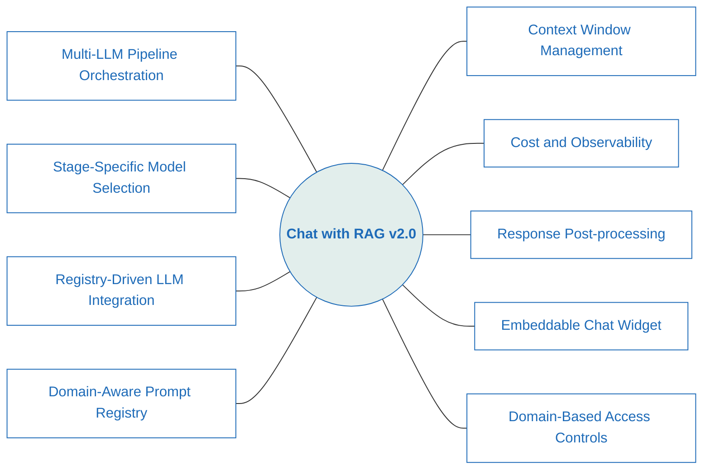
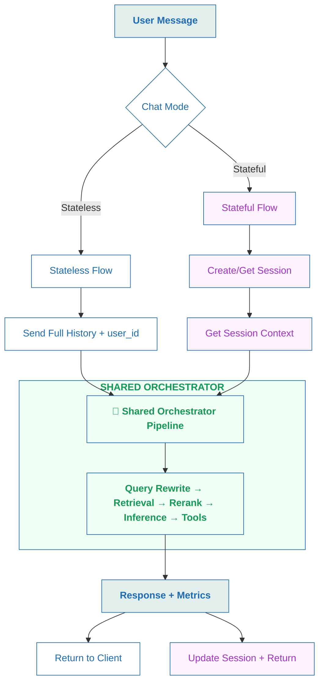

# Chat with Your Docs: End-to-End RAG Pipeline


A modular **Retrieval-Augmented Generation (RAG) framework** for building AI applications that generate **grounded answers with citations** from unstructured documents.

The system implements an explicit, **multi-stage** orchestration **pipeline** covering high-fidelity **ingestion**, **retrieval**, **reasoning**, **tool** execution, and **response** synthesis.

Unlike simple vector-search demos, this project exposes each stage of the RAG pipeline as a **configurable and observable component**, enabling experimentation with retrieval strategies, **prompt design**, **model selection**, and **cost control**.

>All LLM interactions are handled through the standalone Python library **[vrraj-llm-adapter](https://pypi.org/project/vrraj-llm-adapter/)** — a registry-driven adapter that normalizes requests, responses, tool calls, and usage accounting across providers.

**Get Started:** See section [Getting Started](#-getting-started) to run the system locally.

### 🆕 What's New in v2.0

- **Multi‑LLM Pipeline Orchestration**  
The application supports multiple LLM providers through the **vrraj‑llm‑adapter**.

- **Stage-Specific Model Selection**  
Runtime model selection per pipeline stage (rewrite, rerank, summarization, inference) via UI or API.

- **Registry-Driven LLM Integration**  
Model configuration, pricing metadata, and parameter policies are referenced from the adapter’s defaultregistry. You may extend or override these defaults using a **custom registry** - no application code changes needed. 

- **Domain-Aware Prompt Registry**  
Centralized prompt control layer that decouples prompts from application code. Prompts for each pipeline stage are defined in a **YAML-driven registry** (`prompts/prompt_registry.yaml`) and can be switched dynamically using `prompt_domain`, enabling rapid prompt experimentation and domain‑specific pipeline behavior without redeploying the system.

- **Advanced Context Window Management**  
Hybrid strategy combining summarized conversation history with recent verbatim turns to maintain context while controlling token usage. [See Technical Overview](docs/technical-overview.md#5-context-assembly) for implementation details.

- **Cost Tracking and Observability**  
Configurable controls for all pipeline stages with cost tracking.

- **Response Post-processing**  
Currently supports Markdown → scoped HTML conversion and can be extended for additional post-processing workflows.

- **Embeddable Chat Widget**  
Drop-in widget with comprehensive configuration via API params.

- **Domain-Based Access Controls**  
Isolation and authorization enforced consistently across APIs and embedded clients.

**For additional details, see the [Release Notes 2.0](Release_Notes_2.0.md).**



> **Auth & Security Note**  
This app enforces **domain-based access controls** across APIs and embedded widgets (domain isolation, collection separation, widget lockdown). See **[Security & Deployment](#-security--deployment)** for more details.


---

## High-Level RAG Pipeline Overview

The system runs through two parallel workflows: an **Ingestion Pipeline** (build the knowledge base) and a **Chat Orchestration Pipeline** (retrieve + answer).


| Pipeline | Flow |
|---|---|
| **Ingestion** | `Documents / URLs` → `Load Sources` → `Extract & Parse` → `Chunk & Normalize` → `Metadata Augmentation` → `Embeddings` → `Vector Storage` |
| **Chat** | `User Prompt` → `Query Rewrite` → `Retrieval` → `Rerank` → `Context Assembly` → `LLM Inference` → `Tool Execution` → `Response Synthesis` → `Post-Processing` → `Final Response` |

```mermaid
%%{init: {'themeVariables': { 'fontSize': '16px', 'subgraphFontSize': '20px', 'subgraphTitleColor': '#1e6bb8'}}}%%
graph LR
    %% Theme Styling from your finalized Hub
    classDef core fill:#e2eeec,stroke:#1e6bb8,stroke-width:1px,color:#1e6bb8,font-weight:bold;
    classDef feat fill:#ffffff,stroke:#1e6bb8,stroke-width:1px,color:#1e6bb8;
    classDef highlight fill:#159957,stroke:#159957,stroke-width:2px,color:#fff,font-weight:bold;

    subgraph "CHAT ORCHESTRATION"
        direction LR
        U[User Prompt] --> QR[Query Rewrite]
        QR --> Search[Retrieval]

        %% Return path from Ingestion back to Chat
        R[Rerank] --> Ctx[Context Assembly] --> Inf[LLM Inference]

        Inf --> Tools{Tool Execution?}
        Tools -- "Yes" --> API[Tool Calls] --> Synth[Response Synthesis] --> Post[Post-Processing]
        Tools -- "No" --> Synth
        Synth --> Post
        Post --> Out[Final Response]
    end

    subgraph "INGESTION PIPELINE"
        direction LR
        S[Sources] --> P[Parse] --> C[Chunk] --> D[Add Metadata] --> E[Embed] --> DB[(Vector DB)]
    end

    %% PHYSICAL CONNECTIONS
    Search -- "Query" --> DB
    DB -- "Results" --> R

    %% Apply Themes
    %% Using 'core' style for the main entry/exit and database
    class U,Out,DB core;
    %% Using 'feat' style for standard logic steps
    class QR,Search,R,Ctx,API,Post,S,P,C,D,E feat;
    %% Using 'highlight' (Cayman Green) for the critical LLM stages
    class Inf,Synth highlight;
```



---

## Example Use Cases

This project serves as a **reference architecture for Retrieval-Augmented Generation (RAG) systems**. Typical use cases include:

- **Document-grounded chat assistants** for PDFs, HTML pages, internal documentation, or MediaWiki sources
- **Multi-model experimentation** comparing OpenAI and Gemini models across different pipeline stages
- **Prompt and retrieval experimentation** using query rewrite, reranking, and domain-specific prompts
- **Embedded knowledge assistants** for websites using the embeddable chat widget
- **API-driven RAG workflows** where chat sessions, document ingestion, embeddable chat, and pipeline stage parameters can be invoked programmatically from external applications or automation workflows
- **Domain-specific knowledge bases** (e.g., travel, healthcare, finance) with separate collections, embeddings, and prompt domains
- **Observability-focused RAG development** where each stage of the pipeline can be inspected, tuned, and cost-tracked

### 📸 Inference Pipeline in Action 

The screenshot below shows the **chat orchestration pipeline in action** during a live conversation. It demonstrates key capabilities of the system:

- Query rewrite for improved retrieval
- Multi‑turn context preservation
- Retrieval + inference working together
- Optional tool calls
- Multi‑model execution (OpenAI and Gemini)
- HTML‑formatted responses with citations

<p align="center">
  <a href="images/chat-pipeline-rewrite-context-tools-inference.png">
    
  </a>
</p>

*Chat pipeline UI showing query rewriting, multi-turn context handling, explicit pipeline stages, tool invocation, and cited responses.*

### 🖥️ Application Workspace
This workspace provides a **simple navigation menu** to access the main parts of the application. From here you can open the chat interface, manage documents, inspect the vector store, run batch ingestion, and generate embeddable chat experiences.

<p align="center">
  <a href="images/content-ingestion-primary-actions.png">
    
  </a>
</p>

*Content ingestion UI showing primary actions and indexing tools (batch upload, PDF/HTML/MediaWiki), estimation mode, and metadata controls.*

---

## Features

### 📥 High-Fidelity Ingestion
- **Multi-Source Extraction** — High-fidelity parsing for **PDFs**, **MediaWiki**, and **HTML**.
- **Intelligent Processing** — Smart chunking (semantic), structure preservation, and configurable noise filtering for cleaner retrieval context.
> **Batch & Scale:** Process local directories (`file://`) or remote URLs with built-in token and cost estimation before indexing.

### 🧠 Advanced Chat Orchestration

Advanced Chat Orchestration coordinates retrieval, context management, prompt selection, model execution, tool integration, observability, and output rendering into a deterministic multi-stage pipeline.

#### 🔧 1. Pipeline Control & Execution Flow
*Defines how models, prompts, providers, tools, and post-processing stages are orchestrated for each request.*

- **Multi-Stage LLM Pipeline Orchestration**  
  Granular control across pipeline stages — Query Rewrite → Retrieval → Rerank → Summarization → Inference → Tools → Post-processing — with stage-specific model selection. Different providers or models can be used per stage based on **cost, capabilities, and task suitability**, configurable at runtime via the UI or API.

- **API-Level Control**  
  Pipeline configuration is available programmatically via FastAPI endpoints for automation, integrations, and workflows.

- **Provider & Prompt Abstraction**  
  The pipeline uses the **vrraj-llm-adapter** and the YAML **prompt registry** to keep model selection, provider differences, and prompt behavior configurable without changing application code.


#### 🧠 2. Context & Memory Management
*Maintains long-running conversational continuity while keeping context size bounded and cache-efficient.*

Long-running conversations remain coherent and performant without exceeding context limits by combining a persistent conversation summary with a short, verbatim recent history. As the conversation grows, older turns are automatically **summarized and merged into the active context**, preserving continuity while maintaining stable context size and cache efficiency.


#### ✏️ 3. Query Intelligence & Rewrite
Improves retrieval accuracy by selectively refining user intent before search. Rewrites are confidence-gated, context-aware (verbatim turns or summaries), and fully configurable or disable-able per request.


#### 🔍 4. Retrieval, Inference & Tool Augmentation
*Combines retrieved knowledge, context assembly, tool use, and model inference to produce grounded answers.*

- **Retrieval Optimization** — Vector search via Qdrant with configurable top-k and score thresholds.

- **Inference Context Assembly** — Final prompts are built from prompt instructions, domain overrides, conversation context, reranked document chunks, optional web results, and the user query.

- **Tool Execution** — Native tool/function calling (currently 'web search`,`get_weather` and `get_airports`) with tool outputs merged into the final synthesis stage.

  > Web search can be added either through an automatic web context stage or via an LLM tool call.

- **Verified Citations** — Final answers include citations to source URLs and document sections where available.


#### 📊 5. Observability & Cost Management
*Provides real-time visibility into pipeline execution, token usage, and per-stage costs.*

- **Real-Time Observability**  
  Live **SSE (Server-Sent Events)** stream exposing pipeline stage execution and intermediate processing events in real time.

- **Granular Cost Tracking**  
  Per-stage token usage and cost metrics for every turn.

#### 🎨 6. Postprocessing & Output Rendering
*Transforms raw LLM output into presentation-ready responses without affecting core inference behavior.*

After inference, responses can be post-processed to deliver a richer, presentation-ready experience in the chat UI.

> This post-processing stage is isolated from inference, ensuring output formatting can evolve independently without affecting core model behavior. In addition post processing can be extended to support custom workflows and transformations.

### 🌐 Embeddable Chat Widget
**Embeddable chat** for any website with full access to pipeline configuration controls.

See the **[Embeddable Widget Configuration](#-embeddable-chat-widget)** section below for detailed implementation examples and all available options.


---

## 🚀 Getting Started

Get the system running in minutes using the provided `Makefile`. This setup uses Docker for the core infrastructure while maintaining a developer-friendly local environment through volume mounting.

> **Provider Note:** The system supports both **OpenAI** and **Gemini**, and providers can be switched or mixed **per pipeline stage** after setup.


### 📋 1. Prerequisites
Ensure your environment meets these requirements before proceeding:
- **OS:** macOS or Linux (Windows supported via Docker).
- **Git** – required to clone the repository. Install: https://git-scm.com/downloads
- **Docker & Docker Compose:** Required for the Qdrant v1.14.1 database and the web app container. [Get Docker here](https://docs.docker.com/get-started/)
- **Python 3.10+:** Required for local development, IDE support, and ingestion scripts.
- **LLM Provider API Key(s):** Required for embeddings and chat inference. Supports **OpenAI** and **Gemini**.


### ⚡ 2.0 Automated Setup (macOS/Linux)

To get the system running quickly, use the setup script below. The script will:

- create `.env` if needed and prompt for `OPENAI_API_KEY`
- start Docker services (`make start`)
- create a Python virtual environment, install dependencies, and seed sample data (`make seed`)

> [!TIP]
> Before running the script, set up your **OpenAI API key** and/or **Gemini API key**. It is also a good idea to configure usage limits or alerts, especially when testing a new system. See [2.1.4 Configure API Keys and Budget Controls](#214-configure-api-keys-and-budget-controls).


**Step 1 — Clone repo and run setup script**

```bash
git clone https://github.com/vrraj/chat-with-rag.git
cd chat-with-rag
bash scripts/rag_setup.sh
```

**Step 2 — Open the application**

Visit `http://localhost:8000`


### 🛠️ 2.1 Manual setup (step-by-step)

> If you ran the **2.0 One-command setup** above, you can skip this entire section.

**2.1.1) Verify Docker Installation**
```bash
# Verify Docker
 docker --version

# Verify Docker Compose (v2 or v1)
 docker compose version || docker-compose --version
```
 You should see version numbers if Docker is installed correctly.

> **Note for Linux Users:** If you get "permission denied," add your user to the docker group: `sudo usermod -aG docker $USER` and then log out/in.

**2.1.2) Clone the Repository**
``` bash
git clone https://github.com/vrraj/chat-with-rag.git
cd chat-with-rag

```

#### 2.1.3 Choose Your Provider(s)

This application supports **multiple AI providers** with different capabilities:

| Provider | Default Use | Key Features | Requirements |
|----------|---------------|---------------|---------------|
| **OpenAI** | ✅ Default provider | Standard models, reasoning models, native API | OpenAI Platform account |
| **Gemini** | ✅ Optional provider | Thinking models, OpenAI-compatible API | Google AI Platform account |

> **Note:** You can use either provider or mix both across different pipeline stages.

For the supported models, endpoint mappings, and registry details, see the **[Model Registry documentation](https://vrraj.github.io/llm-adapter/model-registry.html)**.

#### 2.1.4 Configure API Keys and Budget Controls

Set up your LLM Provider, OpenAI and / or Gemini (API Keys and Budget Limits).
>The setup instructions in this section uses OpenAI for reference. You may follow the same steps for Gemini. 

##### Option A: OpenAI (Getting Started)

| Recommendation | Action | Rationale |
| :--- | :--- | :--- |
| **Budget** | Set a limit of **$5–$10**. | Establishes a safety ceiling for testing. |
| **Dedicated Key** | Name it `chat-with-rag`. | Isolates usage tracking for this specific project. |
| **Alerts** | Set a 50% notification. | Provides proactive cost control. |

##### Option B: Gemini 


| Recommendation | Action | Rationale |
| :--- | :--- | :--- |
| **Quota** | Set a **daily quota limit** based on your budget. | Prevents unexpected cost overruns. |
| **Dedicated Key** | Name it `chat-with-rag-gemini`. | Isolates usage tracking for this project. |
| **Monitoring** | Enable **usage alerts** in Google Cloud Console. | Provides proactive cost visibility. |

> **Note:** Gemini uses quota-based limits instead of hard dollar limits. Configure quotas in Google AI Studio or Google Cloud Console.

##### Option C: Both Providers (Advanced)
Use different providers for different pipeline stages via the UI or API.
> Sample data collection uses OpenAI embeddings (text-embedding-3-small) with 1536 dimensions


#### 2.1.5 Set up local environment variables

Copy the example environment file and add your API key(s).

```bash
cp .env.example .env
# IMPORTANT: Open .env and add your API keys
vi .env   # or use 'nano .env' / your preferred text editor

# Add one or both keys:
OPENAI_API_KEY=your_openai_api_key_here
GEMINI_API_KEY=your_gemini_api_key_here
```


#### 2.1.6 LLM Providers, Models, and Endpoints (Overview)

The system uses a centralized **Model Registry** to define and manage all supported LLM providers, models, and API surfaces. The registry serves as the **single source of truth** for provider routing, model capabilities, and cost tracking, and is consumed uniformly by the application and LLM handler.

Currently the system supports these LLM *endpoints** :

- **Open AI:** : chat-completions, responses API, embeddings
- **Gemini:** : chat-completions (OpenAI compatible adapter), gemini-sdk, embeddings


> Detailed provider behavior, endpoint mappings, and capability flags are documented in **[docs/technical-overview.md](docs/technical-overview.md)** and the model registry itself.


#### 2.1.7 Start Infrastructure

```bash
make start

```
> **Note for macOS Users:**
> `make start` will automatically attempt to launch Docker Desktop if it isn't running. The script will pause briefly while the daemon initializes.


#### 2.1.8 Initialize environment and seed data

To see the RAG system in action immediately, load the sample dataset (~50 outdoor-themed Wikipedia pages). By default, `make seed` uses the sample collection configured for **OpenAI embeddings**. This requires a local Python environment.

```bash
# Create and activate virtual environment
python3 -m venv venv
source venv/bin/activate
# Install dependencies and seed Qdrant
pip install -r requirements.txt 
make seed
deactivate

```

> **Note for Gemini users:** The seeded sample data is built with the default OpenAI embedding configuration. If you switch the embedding model to Gemini, you should re-index the dataset after changing `embedding_model` so the stored vector dimensions remain consistent.

#### 2.1.9 Provider-Specific Configuration

##### Using Gemini as Primary Provider
If you want to use Gemini embeddings instead of OpenAI, update the embedding model in `backend/core/config.py` and then re-index the seeded dataset (or your own collection) so the stored vector dimensions remain consistent.

```python
embedding_model = "gemini:embed"  # Change from "openai:embed_small"
``` 

See **[docs/technical-overview.md](docs/technical-overview.md#-re-embedding-workflow)** for the recommended re-ingestion workflow.

#### 2.1.10 Access the interface
Once the seeding is complete, open your browser and start chatting: 👉 http://localhost:8000


### ▶️ 2.3 Running & Managing the Application

Use the following Make targets to manage the application lifecycle:

- **Start the application stack (Qdrant + web app):**
  ```bash
  make start

  ```

- **Stop the application stack:**
  ```bash
  make stop

  ```

For additional Make targets (logs, reset, reseed, maintenance utilities), refer to:
- the `Makefile` in the project root
- **[docs/technical-overview.md](docs/technical-overview.md#-developer--operator-utilities-makefile)**

For details on the stateless chat API (`POST /chat`) used by `frontend/chat.html`, including request/response shape and parameter options, see:

👉 **[docs/api-reference.md](docs/api-reference.md)**

---

## 🧩 Prompt Registry (YAML)

This repo uses a YAML-based prompt registry to keep prompts centralized and avoid drift between code paths.

### 📝 Registry file

- **Path:** `prompts/prompt_registry.yaml`
- **Role:** Source of truth for stage prompt text and templates.
- **Implementation Detail:** All default prompts and domain-specific overrides are defined in `prompts/prompt_registry.yaml`, which acts as the single source of truth for prompt behavior across the pipeline.
- **Current coverage:** Inference and query rewrite are registry-driven; rerank and summarization use the registry for their fixed instructions/templates.

### 🎯 Prompt domains (`params.prompt_domain`)

You can select a prompt domain per request using `params.prompt_domain`.

- If `prompt_domain` is empty or omitted, the system uses `global_defaults`.
- If `prompt_domain` is set (example: `mountains`), the system applies domain-specific overrides (currently by appending additional domain system instructions).

In the UI (`frontend/chat.html`), the **Prompt Domain** dropdown under **Inference** controls the value sent on every chat request.

For detailed configuration options, see the [Configuration Reference](docs/configuration.md#prompt-registry).


---

## 🪟 Embeddable Chat Widget

A lightweight widget that embeds the **full RAG pipeline** into any website.

The widget exposes the same orchestration used by the main application — **retrieval, reranking, context management, tool calling, and response post‑processing** — while remaining easy to deploy and configure.

> Supports **domain isolation** so different websites can use different knowledge bases and prompt domains.

### ⚙️ Configuration Options

The widget can be configured in two ways:

- **Direct iframe embedding** (simplest)
- **Embed loader script** using HTML `data-*` attributes (advanced configuration)

<p align="center">
  <a href="images/chat-embedding-options.png">
    
  </a>
</p>

*Embeddable chat widget options (inline page or iframe).* 

---

### 🖼️ Simple Example (iframe)

```html
<iframe 
  src="https://your-server.com/chat-embed.html?top_k=5&show_citations=true&namespace=simple-chat"
  width="100%" 
  height="400px"
  style="border: 0; border-radius: 8px;"
  title="Embedded Chat">
</iframe>
```

---

### 🔧 Advanced Example (Embed Loader)

```html
<!-- 1. Target container -->
<div id="chat-embed" 
     data-api-url="https://your-server.com"
     data-model_key="openai:gpt-4o-mini"
     data-temperature="0.7"
     data-top_k="10"
     data-show_processing_steps="true"
     data-show_citations="true"
     data-namespace="oceans">
</div>

<!-- 2. Embed loader script -->
<script src="https://your-server.com/static/embed-loader.js"
        data-target="#chat-embed"
        data-api-url="https://your-server.com"
        data-model_key="openai:gpt-4o-mini"
        data-temperature="0.7"
        data-top_k="10"
        data-show_processing_steps="true"
        data-show_citations="true"
        data-namespace="oceans">
</script>
```

The embed loader automatically initializes the widget and connects it to the configured backend API.


## 🔄 Session-Based (Stateful) Chat API

The system supports both **stateless** and **stateful** chat modes, enabling flexible integration patterns for different use cases.

### 🎯 Quick Overview

| Feature | Stateless (`/chat`) | Session-Based (`/chat/{session_id}`) |
|---------|-------------------|-------------------------------------|
| **History Management** | Client sends full history each request | Server maintains history automatically |
| **Use Case** | Web frontend, simple integrations | Mobile apps, backend systems, multi-device |
| **Pipeline Quality** | Identical RAG pipeline | Identical RAG pipeline |
| **Setup** | No setup required | Create session first |




### 🚀 Quick Start Examples

#### 1. Create a Session
```bash
curl -X POST http://localhost:8000/chat/session
# Response: {"session_id": "12d8cd79-0ee8-4dcd-97a5-5983effcbccd"}
```

#### 2. Send Messages (Context Preserved)
```bash
# First message
curl -X POST http://localhost:8000/chat/12d8cd79-0ee8-4dcd-97a5-5983effcbccd \
  -H "Content-Type: application/json" \
  -d '{
    "message": "What is Mount Everest?",
    "history": [],
    "params": {"top_k": 5, "temperature": 0.7, "max_output_tokens": 500}
  }'

# Follow-up (understands context from previous message)
curl -X POST http://localhost:8000/chat/12d8cd79-0ee8-4dcd-97a5-5983effcbccd \
  -H "Content-Type: application/json" \
  -d '{
    "message": "How tall is it?",
    "history": [],
    "params": {"top_k": 5, "temperature": 0.7, "max_output_tokens": 500}
  }'
```

#### 3. Use Different Models
```bash
curl -X POST http://localhost:8000/chat/session-id \
  -H "Content-Type: application/json" \
  -d '{
    "message": "Explain quantum computing",
    "history": [],
    "params": {
      "top_k": 5,
      "temperature": 0.7,
      "max_output_tokens": 500,
      "model_keys": {
        "inference": "gemini:gemini-2.5-flash"
      }
    }
  }'
```

### 📚 When to Use Session-Based API

| Scenario | Recommended API | Reason |
|----------|----------------|--------|
| **Web frontend** | Stateless (`/chat`) | Simpler, client-managed state |
| **Mobile apps** | Session-based (`/chat/{session_id}`) | Server-side persistence |
| **Backend integrations** | Session-based | Automatic context management |
| **Multi-device access** | Session-based | Shared conversation state |
| **Long-running conversations** | Session-based | Automatic history management |

### 🔧 Key Benefits

- **Automatic context management** - No need to send history in each request
- **Token-aware truncation** - Prevents context overflow automatically  
- **Multi-device support** - Same session accessible from different clients
- **Identical pipeline quality** - Same retrieval, rewrite, and inference as stateless
- **Model override support** - Per-request model selection via `model_keys`
- **Session-based token accounting** - Isolated cost tracking per session

### 📊 Token Accounting & Namespaces

#### Stateless vs Session-Based Token Tracking

| Approach | Namespace Pattern | Token Isolation | Use Case |
|----------|------------------|-----------------|---------|
| **Stateless** | `user_id:conversation_id` | Per conversation | Web frontend, client-managed |
| **Session-Based** | `session:{session_id}` | Per session | Mobile apps, backend systems |

#### How Token Accounting Works

**Stateless (`/chat`):**
```bash
curl -X POST http://localhost:8000/chat \
  -H "Content-Type: application/json" \
  -d '{
    "message": "What is RAG?",
    "history": [],
    "params": {
      "user_id": "user123",
      "conversation_id": "conv456",
      "top_k": 5
    }
  }'
```
- **Namespace:** `user123:conv456`
- **Token tracking:** Isolated per conversation

**Session-Based (`/chat/{session_id}`):**
```bash
curl -X POST http://localhost:8000/chat/12d8cd79-0ee8-4dcd-97a5-5983effcbccd \
  -H "Content-Type: application/json" \
  -d '{
    "message": "What is RAG?",
    "history": [],
    "params": {
      "user_id": "user123",  # Optional
      "top_k": 5
    }
  }'
```
- **Namespace:** `session:12d8cd79-0ee8-4dcd-97a5-5983effcbccd`
- **Token tracking:** Isolated per session

#### Benefits of Namespace Isolation

- **Cost tracking** - Monitor tokens per user/conversation/session
- **Cache management** - Separate caches for different contexts
- **Resource isolation** - Prevent cross-contamination of data
- **Usage analytics** - Track patterns per namespace

### 📖 Learn More

- **[Technical Overview](docs/technical-overview.md#-session-based-stateful-chat)** - Detailed architecture and implementation
- **[API Reference](docs/api-reference.md#session-based-chat-api-stateful-chatsession_id-endpoint)** - Complete API documentation and examples

---

## 🛠️ Included Tools

The chat pipeline supports optional tool use during inference.

Current built-in tools include:

- **Web Search** — Adds external web results to the inference context when enabled
- **Weather** — Returns current weather and forecast data for requested locations
- **Airport Lookup** — Returns nearby airport information for travel- and location-based queries

Tool usage can be enabled per request via the application configuration and is integrated into the final response synthesis stage.

---

## 📚 Knowledge Base and Sample Data

When you run `make seed`, the system populates Qdrant with a high-quality sample dataset of approximately **50 Wikipedia pages**. This focus on world-renowned mountains, national parks, and trails provides a rich environment to test the RAG pipeline's accuracy.

> **Note:** The sample data created by `make seed` is indexed into the `document_index` collection using the default OpenAI embedding key `openai:embed_small` (`text-embedding-3-small`, 1536 dimensions). If you switch to Gemini embeddings, re-index the data after updating the embedding model.

### 📄 Data Attribution
To demonstrate multi-source RAG capabilities, this project includes a sample knowledge base derived from Wikipedia.
* **Source:** 55 curated Wikipedia articles processed via a custom high-fidelity MediaWiki extraction pipeline.
* **Integrity:** Source URLs and author metadata are preserved within the vector payloads to enable **verified citations**.
* **License:** Distributed under [CC BY-SA 4.0](https://creativecommons.org/licenses/by-sa/4.0/).
* **Full Credits:** Detailed source links and compliance information can be found in [docs/attributions.md](docs/attributions.md).

### 🔍 Explore the Data

You can verify the indexed documents through the web interface or the command line:

| Method | Action |
| :--- | :--- |
| **Frontend UI** | Navigate to the **"View Documents"** page to see titles, URLs, and metadata. |
| **Terminal (CLI)** | Run the following to list the first 100 document titles: |

```bash
source venv/bin/activate
python scripts/qdrant_scripts/qdrant_ops.py --list-titles --limit 100

```

### 🔄 Managing Your Collections

The system supports **domain-based collection management** where each domain is tightly coupled with its embedding model to prevent dimension drift and ensure consistency. Selecting a collection automatically sets the compatible embedding model and vector dimensions.

#### **Domain-Based Configuration (Recommended)**

A single `active_domain` setting configures both the collection name and embedding model. This helps prevent dimension drift and ensures consistency.
The system comes with a default configuration for the `default` domain and two additional domains: `mountains` and `oceans`. You may modify /add to the configuration in `backend/core/config.py`.
> *Only one domain can be active at a time, and that defines the Qdrant collection and embedding model.*

```python
# In backend/core/config.py
DOMAIN_EMBEDDING_CONFIG = {
    "default": {
        "collection_name": "document_index",
        "embedding_model_key": "openai:embed_small"
    },
    "mountains": {
        "collection_name": "document_index", 
        "embedding_model_key": "openai:embed_small"
    },
    "oceans": {
        "collection_name": "document_index_gemini",
        "embedding_model_key": "gemini:native-embed"
    }
}

# Active domain selection (single change point)
active_domain: str = "mountains"
```

> [!TIP]
> This approach allows you to maintain multiple "knowledge bases" on the same server. You can swap between domains at any time just by changing the `active_domain` variable.

#### **Collection Management Options**

**Option A: Create Fresh Collections (Recommended)**
Each domain automatically gets its own collection when first used. No manual setup required.

**Option B: Clear Existing Collection**
Use this if you want to completely clear a collection but keep using the same name.

> [!WARNING]
> This action will permanently delete the collection and all vectors within it. This cannot be undone.

```bash
# Activate your environment
source .venv/bin/activate
python scripts/qdrant_scripts/qdrant_ops.py --delete-collection $(python -c "from backend.core.config import settings; print(settings.collection_name)")
```

### 💬 Example Queries
The following examples are based on the seed data.

1. #### Retrieval-based
	•	“Where is Mount Kilimanjaro located?”

	•	“Compare Kilimanjaro with Mount Whitney.”

  • "Elevation of mont blanc in the alps , the current weather and the closest airport"
  
  •	“Which mountain is taller — Everest or Whitney?”

	•	“Where is Mount Whitney located? What is the closest airport to it?”
  
	•	“Tell me about hiking in Patagonia. What is the weather forecast for the area?”

2. ####  Multi-Turn RAG + Tool Calling Demo (Conversation Chain)

The following is a real conversation demonstrating:

- Multi-turn context retention  
- Retrieval + rewrite + rerank  
- Automatic tool invocation (`get_nearby_airports`)  
- Weather queries over prior tool results  
- Final synthesis combining retrieval + tool calls  
- Per-stage cost and token metrics  

USER: where is mount kilimanjaro ?
ASSISTANT:Mount Kilimanjaro is located in Tanzania....

USER: compare kilimanjaro with Mount whitney

ASSISTANT: Mount Kilimanjaro and Mount Whitney are both prominent peaks, but differ in height, location....

USER: what are the closest airports to Mount Kilimanjaro

ASSISTANT:The nearest airport to the coordinates (-3.0674, 37.3556) is **Amboseli Airport (ASV • HKAM)**, ~48 km away.
Tools Used: get_nearby_airports

USER: and for Mount Whitney

ASSISTANT:Closest airports to Mount Whitney (36.5785, -118.2919)....
Tools Used: get_nearby_airports

USER: what is the weather forecast for mount whitney

ASSISTANT:Mount Whitney, California — 28 Oct  High: 7.2 °C (45 °F)....
Tools Used: get_weather


<p align="center">

</p>

*Multi-turn conversation with tool calls and citations. Preserves context and history across turns.*

---

## 📦 Batch Ingestion

Batch ingestion is the recommended way to build or refresh a **knowledge base** from multiple sources at once. It supports local documents, remote URLs, and mixed source sets, with optional estimation before indexing.

> **Note:** Changing the embedding model requires re-embedding and rebuilding the vector index. See **[docs/technical-overview.md](docs/technical-overview.md)** for the recommended re-ingestion workflow.

### 🎯 What It Does

Each source in the batch is processed through the same ingestion pipeline used elsewhere in the application:

`load` → `extract` → `chunk` → `augment metadata` → `embed` → `store`

This makes it the easiest way to populate or refresh Qdrant collections consistently at scale.

### 📁 How to Organize Documents

A practical pattern is to organize source files by topic or domain before ingestion.

```text
data/
├── mountains/
│   ├── everest.pdf
│   ├── kilimanjaro.pdf
│   └── whitney.html
├── oceans/
│   ├── pacific.html
│   └── atlantic.html
└── travel/
    ├── italy-guide.pdf
    └── rome.html
```

This makes it easier to:

- build domain-specific collections
- keep metadata consistent
- re-index a single topic area without rebuilding everything

### 💡 Typical Uses

- ingest a folder of PDFs
- index a curated list of webpages
- process mixed source sets in a single batch
- rebuild a collection after changing chunking or embedding settings

### 📄 Example Batch Configuration

```json
{
  "items": [
    {
      "url": "file:///app/data/mountains/everest.pdf",
      "doc_type": "pdf",
      "skip_sections": ["References", "External links"]
    },
    {
      "url": "https://en.wikipedia.org/wiki/Mount_Whitney",
      "doc_type": "mediawiki"
    }
  ],
  "max_chunks": 100,
  "estimate": true,
  "force_delete": false
}
```

>Start with **`"estimate": true`** to preview cost and processing behavior **before committing** a batch to storage.

See **[Technical Documentation: Batch Ingestion](docs/technical-overview.md#-2a-batch-ingestion)** for provider-specific limits, embedding batch sizing, and advanced ingestion workflows.

## LLM Integration

This system uses the Python package **[vrraj-llm-adapter](https://pypi.org/project/vrraj-llm-adapter/)** to provide a unified interface across multiple LLM providers.

The adapter normalizes model configuration, requests, responses, tool calls, and usage metrics across providers while allowing different models to be used across pipeline stages.

### 🔑 Key Capabilities

- **Multi-Provider Support** — Works with OpenAI and Gemini models
- **Registry-Driven Model Configuration** — Model capabilities, pricing, and parameter policies are defined in a centralized model registry
- **Provider-Agnostic Calls** — The same application code works across providers
- **Custom Model Registries** — Users can extend or override models without changing application code

### ⚙️ Custom Registry Path

To load a user-defined custom model registry, set:

```bash
export CUSTOM_REGISTRY_PATH=/path/to/your/custom_registry.py
```

See the **[Model Registry documentation](https://vrraj.github.io/llm-adapter/model-registry.html)** for the models supported, default model definitions, reasoning model configurations, and guidance on extending the adapter with custom models.

---

## 🏗️ Technical Overview

Technical details about the system architecture, pipelines, design decisions, and engineering approach are available here:

👉 **[docs/technical-overview.md](docs/technical-overview.md)**

This overview covers module structure, extraction pipeline, embedding flow, Qdrant indexing, batch ingestion (local PDFs + URLs with optional cost estimation), chat orchestration, SSE streaming, and frontend–backend integration.

---

## 🗂️ Project Structure

```text
chat-with-rag/
├── backend/      # API, chat orchestration, ingestion pipeline, vector DB integration, tools
├── frontend/     # Chat UI, embed pages, static assets
├── scripts/      # Batch ingestion and maintenance utilities
├── prompts/      # YAML prompt registry
├── docs/         # Technical architecture and API documentation
├── data/         # Seed/demo datasets
└── images/       # README and documentation images
```

See **docs/technical-overview.md** for a deeper architectural breakdown of the system modules and pipelines.


---

## 🔐 Security & Deployment

This application includes a **domain-based access control framework** for APIs and embedded widgets.

### 🛡️ Included Security Controls

- **Domain-Based API Access** — Chat and embedding endpoints can enforce domain-level access rules
- **Embeddable Widget Restrictions** — `chat-embed.html` can be restricted to authorized domains
- **Collection Isolation** — Separate domains can be mapped to different knowledge bases and prompt configurations

These security controls help prevent unauthorized access and ensure that different domains or websites can only access their designated knowledge bases and configurations.

## 📡 API Usage

For complete API documentation including usage examples, request/response formats, and integration guides, see the **[API Reference](docs/api-reference.md)**.

---

## ⚖️ License & Usage

This project is **source-available** for **personal, educational, and evaluation purposes**.  
It is permitted to **run, modify, and fork** the code for non-commercial use.

**Redistribution, sublicensing, or commercial use** of this project or derivative works **requires explicit written permission** from the author.
© 2025 Rajkumar Velliavitil — All Rights Reserved
